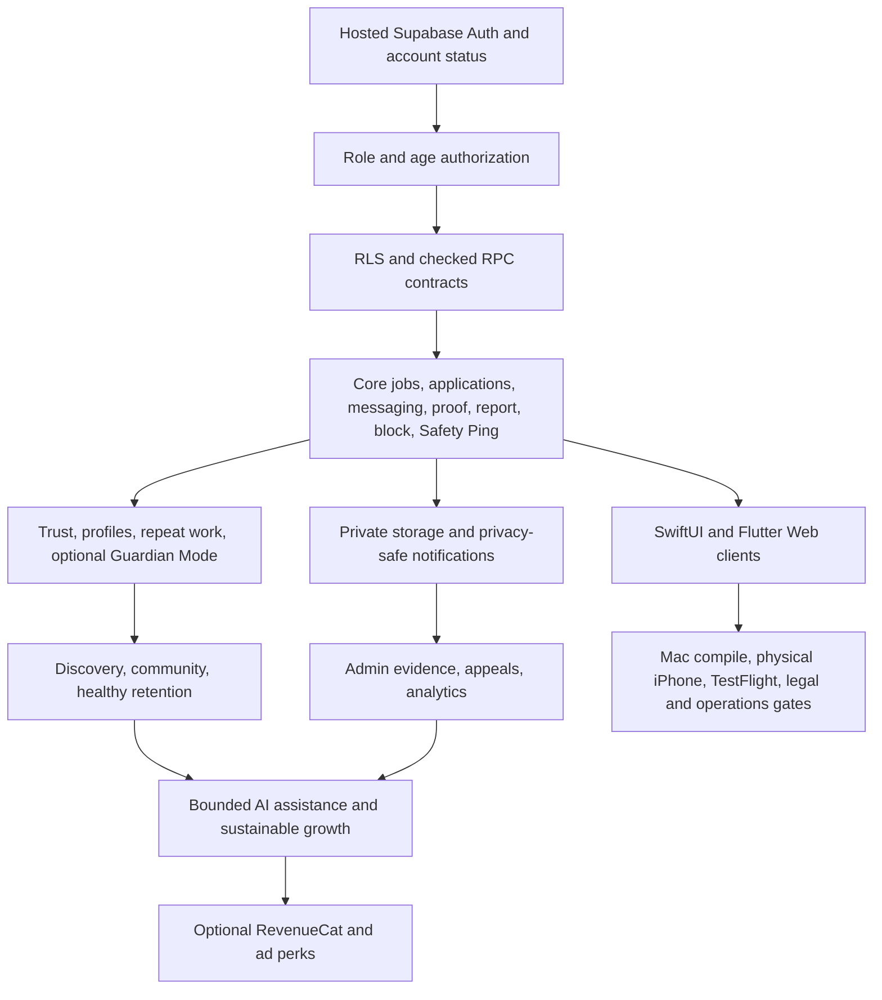

# MORT Feature Dependency Graph

The graph is architectural, not a claim that every roadmap node is implemented.

## Cross-Cutting Gates

Every release slice requires accessible states, privacy minimization, server authority where needed, abuse tests, observability without sensitive payloads, and rollback/recovery behavior.
