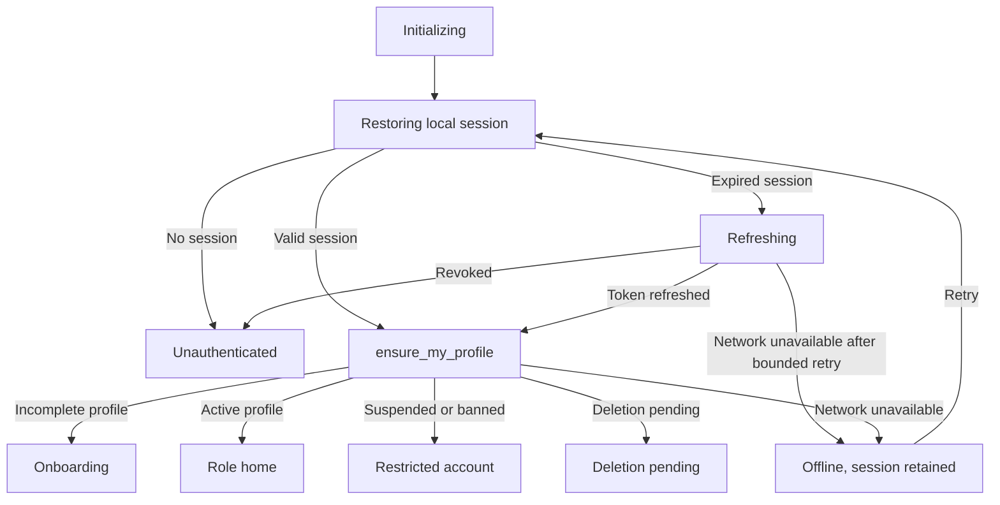

# MORT Secure Session Persistence 0.9.10 Report

Date: 2026-07-29  
Repository: `C:\Users\micha\Mort`  
Flutter app: `C:\Users\micha\Mort\flutter_mort`  
Version: `0.9.10+100`  
Supabase project ref: `rakjydmgwwgtdislanbt`

## Result

Part A is implemented and verified at the source, unit/widget-test, signed-build,
binary-audit, and Android API 36 generic-launch levels. Physical Android session
restart, phone restart, app-update preservation, and real Google OAuth were not
performed because no physical Android device was connected. This report does
not call the app production-ready.

## Root Cause And Prior Gaps

The app already used `flutter_secure_storage` for native Supabase sessions, but
it stored them under the unversioned `mort.supabase.session` key. It did not
migrate a session previously stored under Supabase Flutter's project key
`sb-rakjydmgwwgtdislanbt-auth-token`. Changing storage backends or keys could
therefore make a valid existing session appear missing after an update.

The former startup UI waited only for `Supabase.initialize`. Supabase Flutter v2
returns after loading local storage and may still be refreshing an expired
session. The router could consequently render public or guarded UI before token
refresh and the server-authoritative profile check had settled. Ordinary logout
also relied on an implicit SDK scope, had no Settings action, and did not
explicitly invalidate user-scoped Riverpod state.

## Supabase Initialization

`Supabase.initialize` now explicitly uses:

- `AuthFlowType.pkce`
- `autoRefreshToken: true`
- `detectSessionInUri: true`
- Supabase web local storage on web
- MORT encrypted storage on Android and iOS
- public Supabase URL and anon/publishable key only

No startup path calls `signOut`, deletes a session, or requires Google provider
tokens. `providerToken` and `providerRefreshToken` may remain null.

## Secure Storage

The stable native key is:

`mort.rakjydmgwwgtdislanbt.auth.session.v1`

Android uses `flutter_secure_storage` in the `mort_auth_session` namespace and
Android application backup remains disabled. iOS Keychain storage is
non-synchronizing and uses `first_unlock_this_device`, preventing migration of
the session item to another device. Optional device lock remains off by default
and its preference survives logout.

The one-time migration checks the old secure key and these SharedPreferences
keys:

- `sb-rakjydmgwwgtdislanbt-auth-token`
- `mort.supabase.session`
- Supabase Flutter's legacy `SUPABASE_PERSIST_SESSION_KEY`

A candidate must decode as a structurally valid Supabase session with nonempty
access token, refresh token, token type, expiry, and user ID. MORT writes it to
the new secure key, reads it back, verifies exact equality and structure, and
only then removes the source value. Invalid or unverified values are not
deleted. Migration is idempotent and session contents are never logged.

## Startup State Machine

The controller listens for `initialSession`, `signedIn`, `tokenRefreshed`,
`signedOut`, `userUpdated`, and `userDeleted`, and handles stream errors. It
waits briefly for Supabase Flutter's own recovery before making at most two
bounded explicit refresh attempts. A private route is not shown until
`ensure_my_profile` returns the authenticated user's row. DOB, role,
onboarding, account status, and destination are derived from that server row.

## Logout

Settings now contains a separate **Security and sessions** screen.

- **Sign out on this device** requires confirmation and explicitly uses
  `SignOutScope.local`.
- **Sign out on all devices** has a stronger warning and explicitly uses
  `SignOutScope.global`.
- Both clear the secure session, OAuth flow state, current profile, account
  trust state, jobs, messages, notifications, support, upload, monetization,
  guardian, safety, review, and repository provider state.
- Navigation uses `go('/auth/sign-in')`, so Android back navigation cannot
  reopen the former authenticated stack.
- Theme, accessibility, and optional device-lock preferences are preserved.
- Account deletion remains a distinct, reauthenticated server workflow.

If global revocation cannot be confirmed because the network fails, the local
session is still removed and the UI tells the user to reconnect, sign in, and
retry global sign-out.

## Verification

Commands and real results:

- `flutter pub get`: passed; `shared_preferences 2.5.5` became a direct
  dependency.
- `dart format lib test integration_test`: passed; 174 files checked, 0 changed
  on the final full run.
- `flutter analyze --no-pub`: passed; no issues found.
- Focused storage/startup/logout tests: 23 passed.
- Final focused startup tests: 14 passed.
- Google/OAuth/router/bootstrap compatibility subset: 32 passed.
- `flutter test --no-pub`: 216 passed, 2 expected skips, 0 failed.
- `.\scripts\build-closed-test-apk.ps1`: passed.
- `.\scripts\build-closed-test-aab.ps1`: passed.
- `.\scripts\verify-google-auth-release.ps1`: passed.
- `.\scripts\secret-scan.ps1`: passed.
- `.\scripts\sensitive-file-scan.ps1`: passed; 1,630 files scanned, 50 known
  app media files, 10 available protected values checked.
- `node .\scripts\qa-aab-secret-scan.mjs
  .\build\play\mort-closed-test-0.9.10.aab`: passed; 915 archive entries,
  5 available protected values, and Google client-secret markers checked.
- `.\scripts\qa-android-api36-launch.ps1 -ApkPath
  .\build\play\mort-closed-test-0.9.10.apk`: app installed, process remained
  present, `MainActivity` was top-resumed, and fatal Android/Flutter log scan
  passed. Screenshot capture was unavailable after an ADB disconnect.
- `.\scripts\package-secure-session-persistence-0.9.10.ps1`: passed; the
  staging tree and ZIP contained 1,568 source files and no forbidden credential,
  environment, cache, binary, or archive entries.

## Signed Artifacts

APK: `C:\Users\micha\Mort\build\play\mort-closed-test-0.9.10.apk`

- Size: 62,535,096 bytes
- SHA-256: `698F1BE2544F5D2AC00AC75DE6AC96C07A06A84267FB96C3B8355E45145DE6FB`

AAB: `C:\Users\micha\Mort\build\play\mort-closed-test-0.9.10.aab`

- Size: 48,328,056 bytes
- SHA-256: `054269DE878649E674A0F58D388A7A28FC0599998D27FEE60D7C68F1823E42EB`

Both artifacts use package `com.mortapp.mobile`, version `0.9.10+100`, min SDK
24, target SDK 36, R8/minification, resource shrinking, closed-test Google PKCE,
and the existing MORT upload certificate. Certificate SHA-256 verification
passed against:

`04:42:C2:21:38:B0:D6:23:F9:A6:F4:78:1A:44:2B:F4:A9:33:27:8F:AB:8E:85:76:74:4D:C1:FD:7C:33:4D:EF`

Public marketplace, live payments, ads, IAP, remote push, crash reporting, and
real identity verification remain disabled in this closed-test profile.

## Bugs Fixed During Verification

1. Riverpod 3 exposes `ChangeNotifierProvider` through its compatibility
   library; the missing import was fixed.
2. Two old widget tests expected a public splash without backend configuration;
   they now verify the secure fail-closed screen.
3. The startup fake exposed an untested backend-initialization branch; a real
   fail-closed test was added instead of suppressing the analyzer warning.
4. The API 36 harness allowed cleanup-time `adb emu kill` status to replace a
   successful launch verdict after screenshot disconnect; cleanup now exits 0
   after a successful try block while real exceptions still fail.

## Files Changed For Part A

- `flutter_mort/pubspec.yaml`
- `flutter_mort/pubspec.lock`
- `flutter_mort/lib/app.dart`
- `flutter_mort/lib/core/auth/auth_startup.dart`
- `flutter_mort/lib/core/routing/app_router.dart`
- `flutter_mort/lib/core/widgets/auth_startup_gate.dart`
- `flutter_mort/lib/data/repositories/auth_repository.dart`
- `flutter_mort/lib/data/repositories/providers.dart`
- `flutter_mort/lib/data/services/secure_device_storage.dart`
- `flutter_mort/lib/data/services/secure_session_storage.dart`
- `flutter_mort/lib/data/services/supabase_service.dart`
- `flutter_mort/lib/features/mort_screens.dart`
- `flutter_mort/lib/features/settings/account_management_screens.dart`
- `flutter_mort/test/auth_startup_test.dart`
- `flutter_mort/test/bootstrap_and_button_test.dart`
- `flutter_mort/test/google_auth_contract_test.dart`
- `flutter_mort/test/logout_security_contract_test.dart`
- `flutter_mort/test/secure_session_storage_test.dart`
- `flutter_mort/test/widget_test.dart`
- `scripts/qa-android-api36-launch.ps1`
- `scripts/package-secure-session-persistence-0.9.10.ps1`
- `docs/MORT_SECURE_SESSION_PERSISTENCE_0_9_10_REPORT.md`

## Physical Android Checklist

No physical Android device was connected, so none of these are claimed as
performed:

- Test A: Google sign-in, force-close during onboarding, and restore.
- Test B: completed onboarding, force-close, and correct role-home restore.
- Test C: physical phone restart and session restore.
- Test D: local logout, restart remains logged out, then same-profile sign-in.
- Test E: install the prior APK, sign in, update in place, and retain session.
- Test F: clear application data and require sign-in.
- Test G: uninstall/reinstall and require sign-in.

Cleared data and uninstall are intentionally expected to remove local login
memory. Real Google OAuth, device KeyStore behavior across a phone restart, and
in-place upgrade migration remain mandatory physical-device checks.

## Remaining Blockers

- Complete the seven physical Android tests above on at least one API 26-35
  device and one API 36 device.
- Complete real Google OAuth restart and logout tests with provider tokens null.
- Validate iOS Keychain persistence, force-close, device restart, uninstall,
  and TestFlight upgrade behavior on physical iPhones later.
- Public launch still requires production verification, remote push/crash
  providers, legal/privacy/teen-safety review, moderation operations, App Store
  and Play policy review, and explicit public-marketplace approval.
