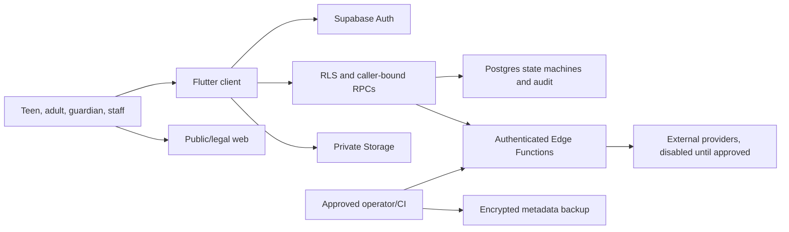

# MORT Supreme Architecture

## Runtime Ownership

- `flutter_mort/` is the authoritative Android/iOS/Web client.
- The root Expo Router app is a preserved reference client and independently
  typechecks, lints, and exports; it is not the native release artifact.
- Supabase project `rakjydmgwwgtdislanbt` owns Auth, Postgres, RLS, Storage,
  Realtime contracts, and Edge Functions.
- Mobile/web clients use only the public Supabase URL and anon/publishable key.
- Service-role, database, provider, webhook, CI signing, and backup secrets stay
  in server/operator secret stores.

## Trust Boundaries

Clients never choose authoritative role, age eligibility, verification,
credits, job state, payment state, evidence access, moderation authority, or
production activation. Those decisions are enforced by hosted profile state,
RLS, grants, triggers, and payload-bound RPCs.

## Safety And Marketplace

Auth/session restoration fails closed before private routing. Onboarding is
server resumable and requires DOB/role/legal acknowledgments. Jobs,
applications, messaging, start/end PINs, proof, reports, blocks, Safety Ping,
guardian links, disputes, moderation, support, and deletion use explicit state
transitions and audit records. Exact address/evidence access is narrowly
released and all Storage buckets are private.

The public marketplace, real identity collection, live payments/payouts,
remote push delivery, external AI, ads/IAP, and crash-provider transmission are
disabled in the signed closed-test profile.

## Release Profiles

Profile validation is shared by Flutter and Android build scripts. Release
artifacts require the expected hosted project, exact auth callback, protected
upload certificate, no debug endpoints, no unapproved monetization, and a
server-authoritative stage gate. `production_public` additionally requires
explicit activation, approved legal versions, identity verification, remote
push, and crash reporting; current configuration intentionally cannot satisfy
those gates.

