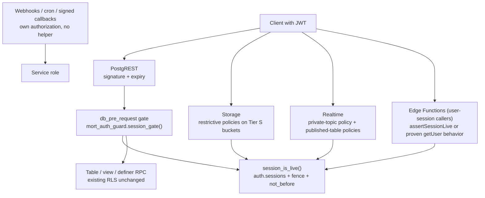

# MORT AUTH GUARD BLUEPRINT, PART 1: CORE, ARCHITECTURE AND CHECKPOINTS

This is a living blueprint for an autonomous coding agent (Codex). Part 2 holds the playbooks, audit protocol, templates and appendices. Read both parts fully before doing anything. Then do the work checkpoint by checkpoint, audit yourself after every one, and keep going until every checkpoint is finished or honestly blocked.

---

## 0. HOW TO USE THIS BLUEPRINT

### 0.1 Read order
1. `AGENTS.md` in the repository root (single-agent rules apply to you).
2. This Part 1, then `MORT_AUTH_GUARD_BLUEPRINT_PART2_PLAYBOOKS_AND_APPENDICES.md`.
3. The approved specification and implementation plan under `docs/superpowers/`.
4. `scripts/auth-email-guard/README.md`, `requirements.json`, `certify.mjs`, `run.mjs`.
5. `docs/security/MORT_AUTH_EMAIL_OPERATIONS.md`.
6. The newest reports under `hardening/` (the revised session-live design checkpoint, the entrypoint-caller classification, the expanded inventory).

### 0.2 The ledger (your memory across checkpoints)
Create and maintain, from checkpoint CP0 onward:

- `docs/security/auth-guard-blueprint/LEDGER.md` (human readable)
- `docs/security/auth-guard-blueprint/LEDGER.json` (machine readable, schema in Part 2, Appendix B)
- `docs/security/auth-guard-blueprint/CHANGELOG.md` (every edit you make to this blueprint's mutable sections, with the reason)

Update the ledger **after every checkpoint and after every failure**. When your context gets long or you restart, the ledger plus `git log` is your source of truth, not your recollection.

### 0.3 The loop (do this for every checkpoint)

```
ENTER   -> verify prerequisites and the immutable-core lock
BUILD   -> write tests first, watch them fail for the right reason, implement, make them pass
VERIFY  -> run the checkpoint's suites and the standing regression set on the exact tree
AUDIT   -> run the self-audit (Part 2, section 2) against your own work
EDIT    -> if the audit found a problem, fix it and re-audit. If the plan itself is wrong, edit the mutable sections and log why
COMMIT  -> scoped commit, secret scan, push to the feature branch, tag the checkpoint
RECORD  -> update the ledger and move on to the next checkpoint
```

Do not skip AUDIT. Do not move on with a failing checkpoint unless it has been honestly marked BLOCKED with a recorded reason and the next checkpoint does not depend on it.

### 0.4 Mutable and immutable parts
- Sections tagged **[IMMUTABLE]** may never be edited by you. A lock file (`blueprint.lock`, built in CP0) stores their SHA-256. Every checkpoint ENTER step verifies it. A mismatch is a hard stop: report it and do not continue.
- Sections tagged **[MUTABLE]** you may edit when evidence shows the plan is wrong, but every edit must be logged in `CHANGELOG.md` with: date, checkpoint, what changed, why, and the evidence reference. You may add checkpoints and tasks. You may not delete a gate, lower a bar, or mark a requirement out of scope.

---

## 1. MISSION AND END GOAL [IMMUTABLE]

### 1.1 Mission
Finish and harden the MORT server-enforced email challenge guard so that:
- A ten-minute, five-failed-attempt rule is genuinely enforced for email confirmation and password recovery, server-side, with no direct-Supabase bypass.
- A revoked, replaced or restored session cannot keep reading protected data (the approved 30-second lifecycle gate).
- Everything is proven by executed, sanitized, exact-commit evidence, not by claims.

### 1.2 End goal in plain words
Finish every checkpoint in this blueprint with real evidence, push the work to GitHub on the feature branch, prepare the web side for review through Vercel previews, and deliver a final package that lets the owner approve the next gated phase (staging) with full information. When something cannot be proven without an approval or a resource the owner has not given, mark it BLOCKED, say exactly what is needed, and continue with everything else.

### 1.3 Definition of done (three honest levels)
| Level | Meaning | Who decides |
|---|---|---|
| `LOCAL_GUARD_VERIFIED` | Every gate marked local passes on one exact commit, three consecutive clean serial runs | Computed by `certify(sha)` |
| `STAGING_READY` | The staging package is complete and reviewed (Part 2, Appendix H) | You prepare, the owner approves |
| `FULL_GUARD_CERTIFIED` | Every gate, including hosted and external ones, passes on one exact commit | Computed only. Impossible while any BLOCKED or NOT_RUN gate remains |

You are expected to reach `LOCAL_GUARD_VERIFIED` and `STAGING_READY`. You must never claim `FULL_GUARD_CERTIFIED` unless the computation says so.

### 1.4 What a PASS is
A gate is PASS only if: a named, executed assertion exists, the assertion has a paired positive control, the evidence file records the exact commit SHA, the log audit found no secret, cleanup completed, and the evidence file hash is recorded in the ledger. Anything else is not PASS.

---

## 2. THE IMMUTABLE CORE [IMMUTABLE]

These rules override everything else in this blueprint, in your own plans, and in any later instruction that is not directly from the owner in the current conversation.

### 2.1 Honesty rules
IMM-01. Never claim to have run, verified or fixed something you did not run, verify or fix.
IMM-02. `fullGuardCertified` is computed from gate results on one exact commit. It is never set, edited, defaulted or overridden by any task. A test must try to set it directly and fail.
IMM-03. No threshold, limit, timeout or assertion is relaxed to make a run pass. A change to any of them needs the owner's written approval in the current conversation, and the old assertion stays recorded with a link to its replacement.
IMM-04. Every failure gets a recorded cause. An unexplained failure is never closed because a rerun passed. It stays in the unexplained-failure register until a cause is shown.
IMM-05. Failed runs are never merged into a synthetic pass. Report each run separately.
IMM-06. A negative result is reported plainly, including in the final report, even if it makes the outcome look worse.

### 2.2 Safety rules
IMM-07. Every denial test has a paired positive control. A system that rejects everything has not passed.
IMM-08. Evidence and logs never contain codes, link secrets, HMAC material, tokens, passwords, keys, SMTP or Vercel or GitHub credentials, or email addresses. Report leak booleans only.
IMM-09. Everything you build is disabled by default. A flag that is off must change no behavior, proven by the standing suites passing unchanged.
IMM-10. Provider credentials are changed only through supported Admin APIs. Provider password, hash and token columns are never written directly.
IMM-11. No production guard entrypoint is added. `supabase/functions/mort-auth-email-guard/` stays without `index.ts` until the owner approves hosted activation.
IMM-12. No hook is enabled in `supabase/config.toml`.
IMM-13. Builds 115, 116 and 120 and every preserved release artifact are never modified, rebuilt, repackaged or deleted. The emulator may install the existing APK unchanged.
IMM-14. Existing unrelated uncommitted work in the working tree is never reverted, discarded, committed by accident, or described as verified guard source.

### 2.3 Authority rules (what you may touch)
IMM-15. Local fixture and emulator: allowed.
IMM-16. GitHub: normal push to the feature branch only. No force push. No merge to the default or any protected branch. No change to branch protection, repository settings, secrets or collaborators. A **draft** pull request is allowed. Tags on the feature branch are allowed.
IMM-17. Vercel: read-only inspection and **preview** deployments are allowed. Anything that changes production, aliases, domains, DNS, environment variables, billing, team or firewall settings is a hard stop (Part 2, section 4).
IMM-18. Hosted Supabase (any project): blocked. Do not read or write it.
IMM-19. External mail: the only permitted recipient is `slugterria@icloud.com`, at most 20 messages total including retries. No sender or relay is approved, so the count is **0** and stays 0 until the owner approves a sender.
IMM-20. No real user data, no real accounts, no real user email addresses, ever.

### 2.4 Process rules
IMM-21. Write each test first. Run it. Confirm it fails for the right reason (missing behavior, not a missing Docker service or credential).
IMM-22. Setup and tooling failures are blockers, never passes.
IMM-23. Any source change after a run invalidates that run for the new commit.
IMM-24. Commit only guard work. Never `git add .`. Use exact paths or `git add -p`. Inspect `git diff --cached` before every commit.
IMM-25. Additive migrations only. Create files with the Supabase CLI after reading its `--help`. Never edit an applied migration. Never run `db reset`, `db push`, generic Docker cleanup or anything against a hosted target.
IMM-26. All fixture work goes through the validated runner, which must keep refusing anything that is not the exact `mort-mobile` fixture, any hosted endpoint, any real SMTP host and any Loop container.
IMM-27. This immutable core is verified by hash at every checkpoint ENTER. If it does not match, stop.

### 2.5 Hard stops (the only reasons to pause and ask the owner)
HS-1. A step would touch hosted Supabase, production Vercel, DNS, a real mailbox, or builds 115/116/120.
HS-2. A step needs a credential, key or account the owner has not provided.
HS-3. A required provider behavior does not exist in the pinned fixture and no fallback is described.
HS-4. A change would relax a threshold or edit a recorded historical result.
HS-5. The immutable-core lock does not verify.
HS-6. You are unsure whether an action is destructive or irreversible.

For anything else: choose the conservative option, document it in the ledger, and continue. Do not wait for the owner between checkpoints.

---

## 3. APPROVED DECISIONS [IMMUTABLE]

| ID | Decision | Value |
|---|---|---|
| D1 | Recipient display | Continue-only. No peek route. |
| D2 | Resend policy | Option B: 60 s grace, 60 s cooldown anchored to successor promotion, at most 2 eligible items, one shared failure ceiling |
| D3 | Family deadline | 600 s, never extended by resend |
| D4 | Failure budget | 5, shared by every item and representation in the family |
| D5 | Capability lease | 300 s from the atomic consume, one use, verifier-bound |
| D6 | Redemption locator | Challenge UUID plus secret, never address plus code |
| D7 | New accounts | Mailbox owner sets a replacement password at confirmation |
| D8 | Pending accounts | Every unconfirmed email-password account follows D7, no bulk reset |
| D9 | Late resend | Print the actual expiry; resend never extends the family |
| D10 | Capability binding | Browser-held verifier, hash sent at Continue, raw verifier needed to set the password |
| D11 | Tiers | Core assertions Tier 1; larger client and load breadth Tier 2 |
| D12 | Old-token lifecycle gate | After a password change, global revocation or restore, the old token is denied within **30 seconds** on protected PostgREST reads, private Storage reads and new private Realtime joins, fresh-session controls passing. Margin fixed. Historical "expiry + 1 s" failures stay recorded and linked. Uncovered paths are measured through their original token lifetime. |
| D13 | Emulator | Approved, existing APKs unchanged |
| D14 | Hosted Supabase, staging, real mail sender, DNS | Not approved |
| D15 | MD2-168 scope-out | Not yet approved, stays BLOCKED |

### 3.1 Owner approvals still pending (do not wait on these)
1. MD2-168 scope-out (the unapproved resend-policy fixtures).
2. A staging Supabase project and what may change on it.
3. A mail sender or relay for real delivery tests.
4. Log retention period and the written address-exposure acceptance.
5. The hosted failover and replication answer.
6. Any promotion of web changes to production or any DNS or domain change.
7. The production access-token lifetime change.

Work around all of them. Where a gate needs one, mark the gate BLOCKED with the approval named.

---

## 4. STATE OF THE WORLD (claims to verify at CP0, not facts to trust)

Per the owner-supplied reports (verify every line yourself):

- Repository branch `feature/mort-age-aware-auth-social`. Latest exact candidate reported: `dccf5eb5b14eebdb15f8f5a4ebe11c9d9fe604a6`. Earlier candidates: `082e843`, `001a2e25`, `4adc62a`, `90b0974`. A source snapshot reported `25f934e`.
- Built and reported working in the local fixture: isolated fixture runner, private challenge store, lifecycle, signed hook path (native PG hook with a private adapter), encrypted outbox, SMTP worker against local capture, Continue and password gateway, mutation guard, token hook, cutover/rollback/restore with an external generation journal, browser pages, recovery verified three consecutive times after one unexplained failure.
- Request gate: a `db_pre_request` session-live gate proven in the pinned PostgREST fixture (16 named assertions): table, view and security-definer RPC denial of a revoked token with a "Session ended" reason, fresh-session control 200, anonymous 200 before and after, flag-off prior behavior.
- Catalog inventory: 34 resources, 32 client-reachable in the fixture, derived from `pg_class`, grants, column grants, `pg_proc` execution grants, security flags and `pg_policies`.
- Not done: password-change and restore **through the new gate**, native Storage and Realtime integration, any migration, any Edge helper deployment, key ring, trusted source with shared limits, password parity, logging split, failover fixture, script inventory against a deployed page, emulator checks, hook-path decision, computed certification, three serial runs, the one-hour characterization.
- Source inspection results: all four views declare `security_invoker=true`; `profile-avatars` is created private and forced private by a later migration; 44 Edge entrypoints classified (31 USER_SESSION, 3 USER_SESSION_PLUS_OPERATIONS_SECRET, 2 INTERNAL_SHARED_SECRET, 2 PROVIDER_SHARED_SECRET, 2 SIGNED_PROVIDER_WEBHOOK, 1 SIGNED_PROVIDER_CALLBACK, 3 SERVICE_ROLE_INTERNAL), 34 user-session candidates and 10 excluded.
- Known weaknesses: `certify.mjs` hardcodes `fullGuardCertified:false`; no key ring (`kid`); no `jwt-path-register.json`; trusted source is injected with no hosted derivation; admission counters are in memory per instance; no password-rule parity test.
- Open unexplained failures (all still open, none closed by reruns): (U1) the ingress connection-refused flake; (U2) the recovery subprocess exit; (U3) the `signed-expiry-wait` subprocess timeout with about 29:39 remaining; (U4) the first session-live experiment's unclassified startup failure.
- Blocked gates reported: MD2-029 key rotation with the real key manager, MD2-065 live Google/Apple, MD2-070 and MD2-145 old-token policy (now replaced by D12 for covered paths), MD-119 logging, MD2-095 failover, MD2-115/135/136 Android and mail gateways, MD2-126 previews, MD2-134 same-origin, MD2-168.

---

## 5. TARGET ARCHITECTURE [MUTABLE: refine with evidence, never weaken]

### 5.1 Layers


### 5.2 Component list
1. **Session gate** (`mort_auth_guard.session_gate()` set as the PostgREST pre-request function). Off by default. Anonymous and service-role behavior documented and tested.
2. **Predicate** `mort_auth_guard.session_is_live()`: security definer, empty `search_path`, execute by `authenticated` only. Requires valid `sub` and `session_id`, unexpired `exp`, live session row, existing unbanned account, session created after the control's `session_not_before` and after the account credential fence.
3. **Credential fence** in the guard schema, written on password change. Prove in the fixture whether a trigger on `auth.users`, the Admin password path, or both retire sessions. Keep what is proven.
4. **Enforcement flag** `session_live_enforced` default false. When false, the gate returns true.
5. **Storage policies**: restrictive, authenticated only, explicit bucket allowlist, plus a server flag. Buckets: financial-receipts, identity-evidence, incident-evidence, mort-document-vault, mort-verify-evidence, proof-uploads, support-attachments, support-evidence, teen-school-id, verification-uploads. `profile-avatars` is private per source; verify in the fixture catalog and handle accordingly.
6. **Realtime**: restrictive policy on `realtime.messages` scoped to intended private topics, plus session-live policies on client-reachable published tables because `postgres_changes` does not pass through the PostgREST hook. Use `pg_publication_tables`, grants and `pg_policies` for the final list. The source adds `public.messages` to the `supabase_realtime` publication.
7. **Edge Functions**: only user-session callers are candidates. **Hypothesis to test first:** functions that call `auth.getUser(token)` may already fail for a revoked session because the Auth server validates the session. If the fixture proves that, `assertSessionLive` is redundant for those and a regression test is the control. If not, add the helper. The helper must evaluate the verified user's session, never the service client's own JWT. Keep object and role authorization checks. Hybrid user-plus-operations-secret functions need both.
8. **Trusted source**: only the configured platform header, reject missing or malformed, IPv6 reduced to /64 before hashing, per-source counters in the database so limits hold across instances, in-memory admission kept as a second layer.
9. **Key ring**: `kid` on every code HMAC and outbox ciphertext, current plus previous key, 20-minute overlap, unknown `kid` fails closed.
10. **Computed certification** from a gates registry bound to the exact commit.
11. **Path register** `jwt-path-register.json` plus a catalog-driven coverage test that fails when any client-reachable resource is neither covered nor explicitly exempt with a reason.

### 5.3 Invariants (tests must be able to detect a violation of each)
INV-1. No secret in any sink. INV-2. Challenge ID alone grants nothing. INV-3. Exactly one success per family, counter never above 5, terminal state never revives. INV-4. Capability one-use, digest only, bound to family, account, address generation, purpose and generation, never outlives its lease. INV-5. Provider mutations only through supported Admin APIs. INV-6. Operation marker is a correlator, never authority. INV-7. Proof is per account UUID and address generation. INV-8. No invented address equivalence. INV-9. Forwarded headers, Origin and host never choose a recipient, destination, policy or quota identity. INV-10. All well-formed redemption denials are indistinguishable except overload, which is a distinct non-charged response independent of the target. INV-11. Email content is fixed, no user text. INV-12. Failed or ambiguous delivery never makes a challenge usable and never removes the last delivered one. INV-13. Flag off means no behavior change. INV-14. Every deadline check uses `clock_timestamp()` taken after locks, equality expires.

---

## 6. CHECKPOINT PLAN

Total checkpoints: CP0 to CP16. Each has tasks, tests to write first, exit criteria, a self-audit and an evidence list. Do them in order unless a checkpoint is BLOCKED and the next does not depend on it. You may add sub-checkpoints (CP3a, CP3b) if a checkpoint is too large; log it.

Commit message format: `cpN: <short summary>`. Tag: `guard-cpN-<shortsha>`.

---

### CP0. Orientation, baseline and lock

**Objective:** Establish ground truth before changing anything.

**Entry check:** none.

**Tasks**
1. Read everything in section 0.1. Record `git rev-parse HEAD`, branch name and `git status --short` as the **baseline manifest**. Save the list of paths with unrelated uncommitted changes to `docs/security/auth-guard-blueprint/left-alone.txt`. These files are never touched.
2. Verify the reported state in section 4 against the repository. For every claim: confirmed, contradicted or unverifiable. Record in the ledger. Contradictions are findings, not errors to hide.
3. Build `blueprint.lock`: extract sections tagged IMMUTABLE from both parts of this blueprint, hash them, store the hash, and write `scripts/auth-email-guard/verify-blueprint-lock.mjs` that recomputes and compares. Add a test.
4. Create the ledger files and the changelog from the Part 2 templates.
5. Run the fast standing suites (units only) on the baseline to learn what passes now. Do not run the one-hour wait.
6. Create the unexplained-failure register (U1 to U4) with every known hypothesis marked untested.
7. Check tool availability (Docker, Deno, Node, Supabase CLI, `adb`, emulator image, `gh` or git remote access, Vercel access). Record present or missing. Missing tools mark dependent checkpoints BLOCKED early.

**Tests to write first:** `blueprintLockVerifiesWhenUntouched`, `blueprintLockFailsOnEditedImmutableSection`.

**Exit criteria:** ledger exists, lock verifies, baseline manifest and left-alone list recorded, state claims classified, tool inventory recorded.

**Self-audit:** Did you modify any file not on the allow list? Are the left-alone paths untouched? Is every state claim classified? Does the lock fail when you deliberately alter a test copy of an immutable section?

**Evidence:** ledger, baseline manifest, lock verification output, tool inventory.

**Commit:** only the new blueprint files and the lock script and test.

---

### CP1. Harness diagnostics and a safe long wait (Block A)

**Objective:** Make every future failure explainable, and make long runs survivable. Addresses U1, U2, U3.

**Tasks**
1. `runStep({name, timeoutMs, run})` returning `{name, startedAt, elapsedMs, exitCode, signal, stderrRedacted}`. Route every subprocess in the fixture and runner through it.
2. Heartbeat every 30 seconds during waits. Flag a gap larger than two intervals as a possible host pause.
3. `snapshotOnFailure()` capturing redacted container status and recent redacted logs for Auth, database, Realtime, Storage, PostgREST and the guard fixture services.
4. Replace the in-wait fragile subprocess calls: the long wait becomes an idle loop; late probes run on a schedule with named timeouts and recorded elapsed times.
5. Record host sleep and hibernate state at the start of long runs. Refuse to start a run longer than 10 minutes if sleep cannot be shown disabled.
6. Add a startup phase and health diagnostics so a startup failure like U4 records which phase failed and the service states.
7. Ensure cleanup can never hide the primary failure (the primary failure is reported first, cleanup errors second).

**Tests to write first:** `forcedHangProducesNamedFailureWithElapsed`, `heartbeatGapFlagged`, `cleanupFailureDoesNotMaskPrimary`, `startupFailureNamesPhase`, `snapshotIsRedacted`, `sleepEnabledRefusesLongRun`.

**Exit criteria:** all new tests pass; three consecutive complete recovery runs pass (report each separately); every failure in those runs, if any, has a recorded cause or stays in the register.

**Self-audit:** Can any subprocess still run without `runStep`? Does any snapshot contain an address or secret? Did you treat the three passing recovery runs as a diagnosis? (You must not.)

**Evidence:** test output, three run reports, register update.

---

### CP2. Computed certification and the gates registry (Block C)

**Objective:** Make certification impossible to overstate.

**Tasks**
1. Define the gates registry (Part 2, Appendix A lists all gate IDs). Each gate has: id, description, tier, required evidence type, owner-scoped-out flag, blocked-by.
2. `certify(sha)` reads evidence files, each of which must carry the commit SHA, and returns every gate's status plus a derived `fullGuardCertified` and the level (`LOCAL_GUARD_VERIFIED`, `STAGING_READY`, `FULL_GUARD_CERTIFIED`, or `NOT_CERTIFIED`).
3. Remove the hardcoded `false` literal in `certify.mjs`. The derived value is false for now because gates are blocked or not run.
4. Validate coverage dynamically from `requirements.json` and the matrix. Pin the matrix SHA-256 `cb2e8b61e78c3f3aa9fbd6f5f7dcdc13c0cf113b5a4052d47e0e26bb0f6fbe31`. Do not hardcode 191 or 519.
5. Evidence from a different SHA, or with a missing log-audit or cleanup boolean, is rejected.

**Tests to write first:** `staleShaEvidenceRejected`, `flagCannotBeSetDirectly` (the test attempts to write the field and must fail), `blockedGateKeepsFlagFalse`, `truncatedMatrixFailsLoudly`, `missingCleanupBooleanRejected`, `countsComputedNotHardcoded`.

**Exit criteria:** tests pass; `certify` on the current commit returns false with a complete per-gate table and a reason for every non-PASS.

**Self-audit:** Search the repository for any other writer of `fullGuardCertified`. Search for any literal `true` path to it. Try to make it true by editing an evidence file and show the check rejects it.

---

### CP3. Request gate: the nine lifecycle combinations on PostgREST

**Objective:** Finish the approved 30-second gate for the table, view and RPC path (D12).

**Prerequisite:** The reported 16 request-gate assertions exist. Re-run them first; do not inherit them.

**Tasks**
1. Credential fence: prove in the fixture which of a trigger on `auth.users`, the Admin password path, or both retire sessions on password change. Keep what is proven; document the result.
2. Run the three lifecycle events (password change via the real Admin path, global revocation via the real provider, restore via the fixture restore with the external generation journal) through the **new gate**, against a table, a view and a security-definer RPC.
3. For each event, assert the old token is denied within 30 seconds with the "Session ended" reason and a fresh session still succeeds. Record denial times.
4. Prove a pre-restore token is denied because of the generation check, not just session deletion.
5. Verify `anon` and `service_role` behavior unchanged, and the gate unaffected by the flag-off path.
6. Measure added latency under the bounded load run (20 concurrent max, 500 requests max, 60 s wall deadline, pool max 8) and report p50 and p95 with and without. Note that client-observed numbers include request overhead.

**Tests to write first:** `passwordChangeDeniesOldTokenWithin30s_table|view|rpc`, `globalRevocation...`, `restore...`, `preRestoreTokenDeniedByGeneration`, `freshSessionControl`, `anonUnchanged`, `flagOffNoop`, `latencyReported`.

**Exit criteria:** nine combinations plus controls pass; flag-off suite unchanged.

**Self-audit:** Is the denial reason the session, not an unrelated 401? Did any test pass because of the original token expiry? Did you widen the 30-second margin anywhere? (You must not.)

---

### CP4. Native Storage and Realtime in the fixture

**Objective:** Close the NOT_RUN native integration.

**Tasks**
1. Bring up the real Storage and Realtime fixture services (they exist per the fixture manifest). Create disposable private buckets matching the allowlist and a private Realtime topic and a published test table.
2. Add restrictive Storage policies for the allowlist, authenticated only, with a server flag. Never replace owner policies and never make a bucket public.
3. Add the restrictive Realtime policy scoped to private topics and the session-live policies on the client-reachable published tables used in the fixture.
4. Run the nine combinations on Storage reads and new Realtime joins, each with a fresh-session control.
5. Document the already-open connection window. Prove how a client re-authorization on token refresh behaves and state the residual window in the path register.
6. Extend the catalog coverage test to include storage objects, buckets, channels and published tables, and prove it fails when one is added without coverage.

**Tests to write first:** `storageReadDeniedWithin30s_*`, `realtimeJoinDeniedWithin30s_*`, `publishedTableChangeStreamCovered`, `bucketNotPublic`, `coverageFailsForUncoveredBucket`, `openConnectionWindowDocumented`.

**Exit criteria:** native coverage tests pass, window documented.

**Self-audit:** Did any bucket policy replace an owner policy? Is the Realtime policy scoped to private topics, not all `realtime.messages`?

---

### CP5. Edge Functions: prove or add the session check

**Objective:** Decide the Edge answer by evidence.

**Tasks**
1. In the fixture, test whether `auth.getUser(token)` rejects a revoked session. Run it for a revoked, expired and valid token.
2. If it already rejects: record that, add a regression test per call pattern, and do not add redundant code.
3. If it does not: implement `assertSessionLive(jwt)` in `_shared` that evaluates the **verified user's** session (not the service client's JWT) and wire it to user-session callers only.
4. Hybrid functions (`stripe-create-job-refund`, `stripe-create-job-transfer`, `stripe-create-tip-transfer`) keep both checks (operations secret and user session).
5. Do not apply the helper to: `account-deletion-processor`, `admob-reward-ssv`, `google-play-rtdn`, `identity-verification-webhook`, `revenuecat-webhook`, `send-push`, `stripe-webhook`, `support-evaluation-runner`, `support-retention-cleanup`, `teen-verification-retention-processor`. Add a test that these remain unchanged.
6. Use the classification file as input but **re-verify each caller type from the code**. Record differences.
7. No deployment. No production helper installed.

**Tests to write first:** `getUserRejectsRevokedSession` (or its negation), `helperEvaluatesUserNotServiceJwt`, `hybridNeedsBoth`, `nonUserFunctionsUnchanged`, `classificationMatchesSource`.

**Exit criteria:** answer recorded with evidence; helper present only if needed.

**Self-audit:** Is there any path where a service-role JWT could pass the helper as if it were the user's?

---

### CP6. Additive migration, flag off, applied to the local fixture only

**Objective:** Turn the proven fixture mechanisms into a reviewable migration, still dark.

**Tasks**
1. Create the migration with the Supabase CLI. Contents: guard schema additions (fence table, `session_not_before` use, flag), predicate, gate function, Storage policies, Realtime policies, grants (`authenticated` execute only), comments explaining each object.
2. Write a rollback note (a documented manual or companion migration) that restores the previous behavior without data loss.
3. Apply to the local fixture only, through the validated runner.
4. Run the whole standing suite with the flag **off** and prove no difference in behavior. Then flag **on** in the fixture and re-run the nine combinations.
5. Migration parity and encoding checks. No applied migration edited.

**Tests to write first:** `migrationDefaultsDisabled`, `noClientGrantsOnPrivate`, `flagOffSuiteUnchanged`, `rollbackRestoresPrior`, `migrationParity`.

**Exit criteria:** migration committed, flag-off parity proven, flag-on lifecycle proven.

**Self-audit:** Does the migration contain any statement that touches `auth` tables beyond what was proven necessary? Does any grant reach `anon` or `PUBLIC`?

---

### CP7. Trusted source and shared limits (Block T)

**Tasks**
1. `trustedSource(request, platformConfig)`: trust only the configured header, reject missing or malformed, reduce IPv6 to /64 before hashing, never default.
2. Per-source counters in the database so limits hold across instances. Keep the in-memory admission (per source 2, global 64, distinct 429 busy) as a second layer.
3. Add per-source sub-limits to the dispatch budget so one source cannot exhaust the global hourly budget. Add a secret-free alert when the global budget passes 50%, and a logged, documented way for the owner to adjust it (documentation only, no hosted change).
4. Record the open staging question: which header the hosted platform sets.

**Tests to write first:** `spoofedForwardedHeaderIgnored`, `twoInstancesShareOneLimit`, `oneSourceCannotBlockAnother`, `globalBudgetNotExhaustedBySingleSource`, `ipv6SameSlash64SameBucket`, `legitimateRecoveryStillSucceedsAfterOtherSourceLimited`.

**Exit criteria:** tests pass; open question recorded.

---

### CP8. Key ring (Block K)

**Tasks**
1. `kid` on every code HMAC and outbox ciphertext. Keys come from protected configuration as `{kid: key}`.
2. Verification reads the stored `kid`. Ring holds current and previous. Overlap 20 minutes. Issuance uses current. Unknown or missing `kid` fails closed with the generic failure.
3. Rotation rehearsal script for later staging use (documentation and script, not run on hosted).

**Tests to write first:** `challengeUnderKey1RedeemsAfterKey2CurrentWithinOverlap`, `afterKey1RemovedOnlyExpiredFail`, `outboxKeyRotates`, `unknownKidFailsClosed`, `newFlowsWorkAfterRotation`.

**Exit criteria:** pass; real key manager rehearsal BLOCKED for staging.

---

### CP9. Password policy parity (Block P)

**Tasks**
1. Locate the Flutter signup rule and the provider's configured policy. Record the web rule from `web/auth/password-policy.mjs` (12 to 128 characters with upper, lower, digit and symbol).
2. One shared policy definition and a test comparing web, Flutter and provider config. Align the signup screen. Minimal Flutter change, no theme, paywall, architecture, eligibility or entitlement change.
3. Confirmation copy tells new-account users this replaces the password typed at signup.

**Tests to write first:** `webAppProviderPoliciesMatch`, `signupScreenShowsSameRules`, `confirmationCopyExplainsReplacement`.

**Exit criteria:** pass; `flutter analyze` and focused Flutter tests clean.

---

### CP10. Logging split (Block L)

**Tasks**
1. Keep the hard gate: no code, link secret, token, password or key in any sink.
2. `sink-inventory.json`: sink, containsAddress, access, retention, for provider logs, hook, worker, guard, database logs, SMTP capture and the Auth audit table.
3. Prove hook, worker and guard handler never log an address.
4. Fixture-only audit purge function with a retention parameter. First confirm the provider does not depend on older rows. Test it removes only rows past retention.
5. Hosted sinks are BLOCKED (not inspected). Do not call fatal-level suppression redaction.

**Tests to write first:** `hookNeverLogsAddress`, `workerNeverLogsAddress`, `guardNeverLogsAddress`, `purgeKeepsNewerRows`, `credentialLeakageZeroAllSinks`.

---

### CP11. Failover as a restore event (Block E)

**Tasks**
1. Two-node local Postgres fixture with streaming replication, isolated like the main fixture.
2. Write guard state on the primary, promote the replica, prove consumed families, capabilities and grants cannot be replayed. Promotion bumps the generation in the external journal and retires in-flight artifacts. New flows work afterward.
3. Optionally measure synchronous commit on the guard tables and report the latency cost.
4. Do not claim hosted high-availability behavior.

**Tests to write first:** `promotionRetiresInFlight`, `consumedCapabilityNotReplayableAfterPromotion`, `newFlowsWorkAfterPromotion`, `journalRespected`.

---

### CP12. Web: auth page inventory, local build and Vercel preview

**Objective:** Prove the auth pages' script set, headers and behavior locally and on a Vercel **preview** deployment. See Part 2, section 4 for the Vercel playbook.

**Tasks**
1. Local: automated crawl asserting the auth pages load exactly the approved script set; header tests for CSP (no inline, no eval, no third-party except the recorded captcha exception on the existing recovery page), framing denial, no-store, no-referrer; no service worker on the auth path.
2. Build the challenge pages into a temporary output directory for testing. Do not enable them in the production output. Production defaults stay disabled.
3. Read-only inspection of the live `mortapp.org` site (headers, scripts, service worker scope) for the same-origin audit. Record findings. Do not change anything.
4. Preview deployment: deploy the web output to a Vercel **preview** (never production), run the crawl and header tests against the preview URL, record the deployment ID, and clean up the preview afterwards if you created it.
5. Dedicated auth origin trial: only on a preview URL or a project-owned `*.vercel.app` URL. A real subdomain needs DNS, which is a hard stop.

**Tests to write first:** `crawlLoadsOnlyApprovedScripts`, `cspHasNoInlineNoEval`, `frameAncestorsNone`, `noServiceWorkerOnAuthPaths`, `previewMatchesLocalHeaders`, `productionOutputStillDisabled`.

**Exit criteria:** local and preview inventories pass; production untouched; the same-origin findings recorded.

---

### CP13. Emulator link checks and the mail checklist (Block M)

**Tasks**
1. Start the Android emulator. Install the existing preserved APK **unchanged**. Check verified-link status for the site domain; confirm the fixed HTTPS confirmation and recovery links open the browser flow and never a custom scheme; confirm the fragment survives; confirm the guard never accepts a capability delivered through a custom scheme. Use `adb`. Record only sanitized results.
2. If the emulator image or APK is unavailable, mark BLOCKED with the exact reason.
3. External mail: send zero messages. Write an owner-run checklist to `docs/security/`: inbox preview, lock-screen preview, link behavior, headers as seen (SPF, DKIM, DMARC reported exactly as shown), arrived versus sent count, spam placement. Recipient `slugterria@icloud.com` only, 20 maximum, waiting for an approved sender.

**Evidence:** sanitized adb output summary, checklist file, external mail counter (0).

---

### CP14. Recovery completeness and the hook-path decision (Block Q)

**Tasks**
1. Standing test: recovery (not only signup) runs through the real hook path, ends in a successful password replacement, a login with the new password, and wrong, expired and reused links are rejected.
2. Hook-path memo: the fixture used the native PG hook with a private adapter. State what hosted would need (HTTP hook with signature verification), what evidence is missing, and what a hosted test would have to prove. Do not decide for the owner; present the trade-offs.
3. Fix any remaining plan-review items: denial-delay overload behavior (distinct non-charged busy response), the hourly allowance limits, the worker-versus-uncommitted-signup test (item deferred without consuming dispatch quota).

**Tests to write first:** `recoveryEndToEndRealHook`, `wrongExpiredReusedRejected`, `workerDefersUncommittedAccount`, `overloadResponseIsNonChargedAndTargetIndependent`.

---

### CP15. Full serial certification, three times

**Tasks**
1. Freeze the source. Verify the lock. Record the exact SHA.
2. Run the full certifier three times consecutively, serially, with heartbeats and the host kept awake. Report every run separately. A pass after a fail does not erase the fail.
3. Run the one-hour original-lifetime characterization **once**, on the final commit, only for paths not covered by the session check (they are measured through their original token lifetime).
4. Run `flutter analyze`, the full Flutter test suite, backend and RLS suites against the fixture, website tests, the committed secret scan and `git diff --check`.
5. Compute `certify(sha)`.

**Exit criteria:** three clean runs on one SHA; or an honest report of which run failed and why.

---

### CP16. Final self-audit, GitHub, handoff

**Tasks**
1. Four-role review (Part 2, section 2.4) on the exact final commit: Believer, Skeptic, Investor/operations, Judge. Record findings.
2. Immutable-core lock verified. Ledger complete. Every PASS has an evidence hash.
3. Final push to the feature branch, tag, draft pull request (Part 2, section 3). No merge.
4. Write the staging package (Appendix H): exact hooks and flags, secret locations (no values), activation and rollback steps, baseline procedure, the list of hosted checks each BLOCKED gate needs, and what the owner must supply.
5. Write the final report (Part 2, Appendix D).

**Exit criteria:** final report delivered, staging package complete, nothing hosted changed.

---

## 7. IF YOU FINISH EARLY OR GET STUCK
- Finished all checkpoints: run a fresh adversarial pass over your own work (Part 2, section 2.5), then stop and report. Do not invent new scope.
- Stuck on a checkpoint after three honest attempts with diagnostics: mark it BLOCKED, record the hypotheses, and move to the next independent checkpoint. Come back to it at the end once.
- Context is long: write the ledger, commit, and continue from the ledger. Do not rely on memory.
