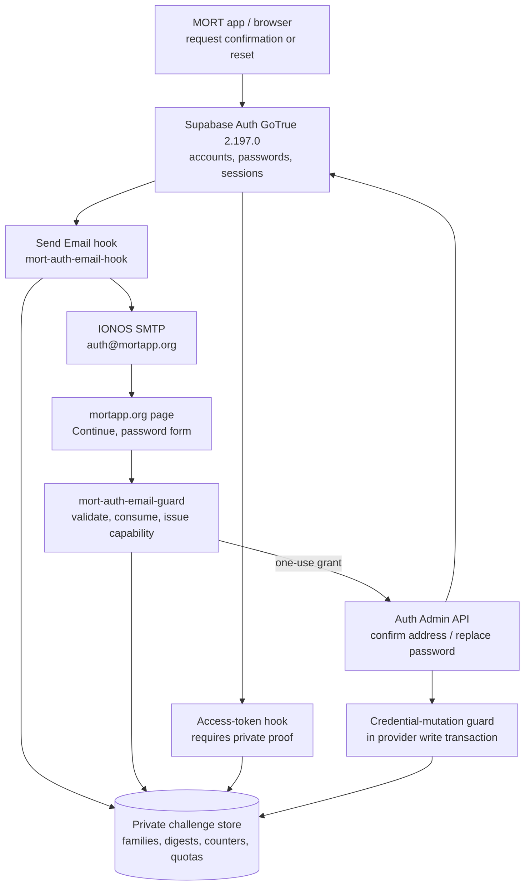
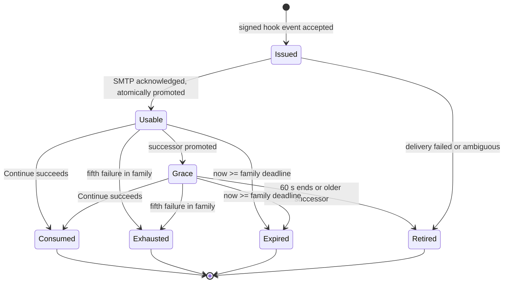

# MORT server-enforced email challenge guard: approved local specification

Version: FINAL DRAFT 1 (2026-10-07)
Status: **APPROVED_FOR_LOCAL_IMPLEMENTATION_PLANNING** on 2026-10-08. Guard implementation and activation have not started. All runtime test statuses are `NOT_RUN`.

Repository review dated 2026-10-08: the owner-supplied attachment has SHA-256 `d40c5f09732cf881450571f0b49848a90df41d097a0e6105dc5efe1ea2794298`. Its original seven unchecked boxes remain preserved in the source artifact. The owner subsequently approved the consolidated specification, section 13A and proposed limits in chat: **"yes i approve it"**. This repository copy records that approval; it is not a handwritten signature or runtime evidence. The supplied 191-case matrix matches the specification's SHA-256 exactly. Implementation-plan review remains the next workflow gate.

This document consolidates the architecture, addenda, review comments and 191-case defensive matrix. The recommended package D1–D12 and section 13A limits are approved for local work. Historical **[OWNER]** markers below refer to the original draft; section 14 records their resolution. Hosted activation requires its own later approval.

---

## 0. What approving this document does and does not do

**Approval authorizes:**
1. Writing the implementation plan.
2. Building and testing the guard **only** against the isolated local `mort-mobile` Supabase stack, with disposable accounts and a local SMTP capture.

The written implementation plan must be reviewed before product implementation, as required by the architectural workflow. Execution is single-agent under `AGENTS.md`; that method is already selected.

**Approval does not authorize:**
- Enabling any hosted hook, changing hosted SMTP/auth, or any production rollout.
- A Play build, repackaging of +115/+116, a merge, payment activation, or starting an emulator.
- Touching Loop or any project other than `mort-mobile`.

Hosted activation is a **separate, later approval** (section 12) that needs all gates passed and a concrete cutover configuration signed off.

---

## 1. Goal and non-goals

**Goal.** Make the ten-minute / five-failed-attempt rule real for MORT email confirmation and password recovery, so an attacker calling Supabase directly cannot obtain a MORT session or recover an account by bypassing MORT's challenge checker.

**Keep unchanged:** Supabase accounts and password storage, normal password sign-in, Google/Apple sign-in, current school-verification rules, UI styling, entitlements, preserved release artifacts, and the existing school-code/invitation protections.

**Non-goals:** a frontend retry counter, replacing or self-hosting Supabase Auth, email-code login, guest mode, SMS/phone OTP, any new role, onboarding state, identity status, payment eligibility or entitlement.

---

## 2. Facts this design rests on

From inspection (no secrets were printed):

- Flutter requests confirmation/recovery links and uses PKCE. The hosted recovery page uses the implicit recovery flow. Phone OTP is a separate, disabled provider.
- Hosted and local Auth are GoTrue `v2.197.0`. Both the Send Email hook and the custom access-token hook are supported, and neither is currently enabled.
- Hosted email confirmation was required at inspection; email token expiry was 600 seconds. The existing local configuration has `enable_confirmations = false`; provider tests must explicitly enable confirmations in an isolated fixture overlay without changing the normal stack silently.
- Hosted inventory at inspection time: 60 confirmed and 2 unconfirmed email accounts. This is historical, not an activation allowlist.
- IONOS SMTP is `smtp.ionos.com:465`. Vault and pgcrypto are available.
- In `v2.197.0`, a PKCE link can confirm the email and issue an authorization code before any access-token hook runs. A wrapper plus access-token hook alone therefore cannot treat `email_confirmed_at` as proof of MORT challenge completion. That is why a credential-mutation guard is part of the design.

---

## 3. Decisions for the owner

The recommended package is below. Choosing "approve package" accepts every row.

| # | Decision | Recommended value | Alternative |
|---|---|---|---|
| D1 | Recipient display | Continue-only: the page performs no secret check on load; **Continue** validates and consumes atomically, then shows the masked address and the password form | Non-consuming peek (more surface; not recommended) |
| D2 | Resend policy | Option B: short overlap. **60 s** grace, **60 s** minimum cooldown anchored to successful successor promotion, at most **2** eligible items, one shared failure ceiling | A: longer cooldown only. C: idempotent redelivery with encrypted outbox |
| D3 | Challenge deadline | Fixed **10 min** from family issuance, never extended by resend | None |
| D4 | Failure budget | **5** wrong guesses per family, shared by every code/link representation | None |
| D5 | Recovery capability lease | Fixed **300 s** from the atomic consume/issue transition, independent of the family deadline; approved 2026-10-08 | Cap at the original family deadline |
| D6 | Redemption locator | Always the email-carried canonical challenge UUID **plus** the secret. No address-plus-code lookup | None (prohibited) |
| D7 | New accounts | Mailbox owner must set a **replacement password** at confirmation; any pre-confirmation password is discarded | None |
| D8 | Pending accounts | Every still-unconfirmed email-password account at cutover follows D7. No bulk reset | None |
| D9 | Late resend | Print the **actual expiry time** in the email and on the page. A resend never extends the family. Starting a new family on a late resend is deferred | New family when under 120 s remain |
| D10 | Capability binding | Page generates a random verifier in memory, sends only its hash at Continue, and must present the verifier to set the password | Plain bearer capability |
| D11 | Tiers | Core assertions Tier 1; large client/load matrices Tier 2 (section 11) | None |
| D12 | Legacy links | Defined window in section 10; approved 2026-10-08 | None |

Approved numeric limits are recorded in section 9 and section 13A.

### Policy exceptions to record if D2 and D5 are approved

Keep the original source expectations and link these exceptions. Do not mark the contradictory old assertions passing.

- **D2 exception:** `MD-019`, `MD-037`, `MD-084`, `DOCX-B01`, `DOCX-B05`, `DOCX-B06`, `MD2-020`, `MD2-090` assumed immediate retirement on resend. Under B, a previously active item may enter bounded grace; a terminally retired item never returns.
- **D5 exception:** `DOCX-H02` checks capability use after the original challenge deadline. Revised: an already-issued capability is valid only before its own fixed deadline; an unconsumed challenge still fails at its original deadline.

---

## 4. Architecture

### 4.1 Components

| Component | Purpose |
|---|---|
| Additive migration | Private tables, narrowly granted service helpers, the hook and the **disabled-by-default** mutation guard control |
| `supabase/functions/mort-auth-email-hook/` | Verifies the signed Send Email event, issues the challenge, queues/sends the email |
| `supabase/functions/mort-auth-email-guard/` | Continue/consume, capability issue, confirmation and password operations |
| Shared helpers | Crypto, parsing, canonical address handling, time, redaction |
| Custom access-token hook | Grants limited to `supabase_auth_admin`; denies email-code session methods; requires private proof for email-password sessions |
| Credential-mutation guard (Postgres) | Checks account email and a live private grant inside the same provider write transaction |
| `web/auth/recovery/` plus a confirmation route | Static pages on `mortapp.org`; site generator copies them to output |
| Flutter | Repository/error handling only where link compatibility needs it. No paywall/theme change |
| Activation/rollback command | Prints an allowlist only |

### 4.2 Logical data model (table names are finalized in the implementation plan)

| Entity | Key fields |
|---|---|
| Challenge family | family id, account UUID, purpose, recipient hash, address generation, `family_expires_at`, `failures`, terminal state, activation/restore generation |
| Challenge item | item UUID (the email-carried locator), family id, code HMAC, link-secret digest, delivery state, `promoted_at`, `grace_until`, item state (`issued`, `usable`, `grace`, `retired`) |
| Verified-address proof | account UUID, address generation, proof state, source (`mort_challenge` or `provider_oauth`) |
| Capability | digest, family id, account UUID, address generation, purpose, `capability_expires_at`, verifier hash, one-use state |
| Operation grant | random operation id, account UUID, address generation, state, lease, fence generation |
| Issuance quota | per account/purpose, per recipient, global, in-flight |
| Hook event ledger | idempotency key, timestamp, outcome |

RLS is enabled on every private table with **no** client grants. Helpers are not executable by `anon` or `authenticated`.

---

## 5. Challenge lifecycle

Rules:

1. **Redemption** always needs the item UUID **and** the code or link secret. The UUID is an opaque locator and grants nothing alone. Missing, malformed, duplicate or noncanonical IDs are rejected before any challenge mutation.
2. **Failure accounting.** A syntactically valid envelope with a canonical ID and a recognized credential representation reaches the checker, and an invalid credential costs one failure. Parser failures (oversized, invalid JSON, duplicate keys, wrong types, unsupported methods) cost nothing.
3. **Shared budget.** All items in a family, and both representations, share one locked counter of 5 and one terminal state. A wrong ID/secret pairing is not charged to the wrong challenge.
4. **Grace.** Starts at the server transition that promotes the SMTP-acknowledged successor. Ends at the earlier of promotion plus 60 s and the family deadline. At most the current and the immediately previous item are eligible. A retired, exhausted, consumed or expired item never re-enters.
5. **Consume.** Success on either item consumes the whole family and issues exactly one capability in one transaction. If capability issuance fails, consumption rolls back. A lost response never permits a second capability; the user requests a fresh, quota-controlled flow.
6. **Time.** Every expiry, grace, capability and grant check uses `clock_timestamp()` taken **after** the row lock is acquired, never transaction-start time and never a client or sender timestamp. Expiry is invalid when `now >= deadline`. Hook freshness also rejects timestamps too far in the future.
7. **SMTP acknowledgment** is not inbox delivery. Queue acknowledgment never makes a challenge usable.

---

## 6. Flows

### 6.1 Signup confirmation (new or still-unconfirmed account)

1. The app signs up as today. GoTrue fires the signed Send Email hook. The hook binds issuance to the signed event and does **not** look up the possibly uncommitted user or insert a foreign key to it.
2. The hook validates signature, timestamp, idempotency key, action type and payload size, issues a family and item, sends the fixed-template email, and promotes the item on SMTP acknowledgment.
3. The email shows the actual expiry time, a fixed HTTPS link on `mortapp.org`, and no user-supplied field. The code is not in the subject or preheader. The link is primary.
4. Page load clears the fragment into memory, shows neutral text, and performs **no** secret-checking request. The page also generates the verifier.
5. **Continue** sends item UUID, secret and verifier hash. The guard validates the now-committed account, consumes the family, and returns the **masked recipient from the server-bound record** plus the restricted capability. The page then shows the password form.
6. The owner chooses a **replacement password** (D7). The page states clearly that this replaces the password typed during signup.
7. The guard validates password policy **before** consuming the capability, then dispatches one guarded Admin operation that binds password replacement, exact-address confirmation and proof creation. Success is shown only after the intended mutation is verified.
8. The owner returns to normal sign-in. No session is created by this flow.

If steps 6 to 7 cannot be done without an intermediate unauthorized session in the pinned provider, **activation is blocked** (provider checkpoint P2).

### 6.2 Password recovery

Same as 6.1 through step 5, then the owner sets a new password. Recovery of an unconfirmed account never implicitly confirms it. Recovery issues no login, performs no account lookup and changes no role or entitlement.

### 6.3 Resend

- Requests are accepted under the issuance quota and the 60 s cooldown measured from the last successful promotion.
- A separate in-flight control stops retries from bypassing quotas while mail is pending, with a hard timeout **shorter than the cooldown** so a stalled SMTP server cannot lock out the owner.
- A resend never extends the family deadline or resets failures. A late resend simply has a short life, which the email states.

### 6.4 Sign-in gating

- The access-token hook denies sessions from `otp`, `magiclink`, `recovery`, `invite`, `email/signup` and `email_change` (actual GoTrue method values are verified locally, including phone label overlap).
- Password sign-in for the new email flow requires a proof bound to the account UUID **and** current address generation.
- Google/Apple sessions and refreshes continue. A verified, matching OAuth identity from provider-owned data satisfies the proof. An unconfirmed email-password identity never gains password authority through OAuth.
- No existing user gains a role, onboarding state, school proof, payment eligibility or entitlement.

---

## 7. Invariants (must always hold)

1. No credential, link secret, code, HMAC, provider token, password or SMTP credential appears in any log, URL query, report, error body or stored challenge row in plaintext.
2. A challenge ID alone never displays a target, consumes, issues a capability, confirms, resets or signs in.
3. Exactly one success can commit per family; the counter never exceeds 5; terminal state never revives.
4. A capability is one-use, stored as a digest, bound to family, account UUID, address generation, purpose and activation/restore generation, and never outlives its own fixed lease.
5. A consumed capability can never be replayed, reopened for another password, or revived by a service failure.
6. Provider mutations use supported Auth Admin APIs only. Provider password, hash and token columns are never written directly.
7. The operation id in `app_metadata` is a correlator, not authorization. Authorization is the private grant checked inside the provider write transaction.
8. Client-editable `user_metadata` is never proof or authority.
9. Proof belongs to an account UUID and address generation. An address change retires the old generation; changing back does not resurrect it.
10. No invented address equivalence (Gmail dots, plus aliases, Unicode lookalikes). One verified canonicalization policy is used in every runtime, and the SMTP envelope has exactly one recipient equal to the bound address.
11. Public forwarded headers, `Origin` and host values never select a recipient, destination, policy or quota identity.
12. Unknown, expired, exhausted, consumed and wrong-secret cases return the same generic failure, with no useful difference in body, size, headers or timing.
13. Email content is fixed. No display name, redirect field or other user text enters the greeting, destination or HTML.
14. Failed or ambiguous delivery never makes a challenge usable and never removes the last legitimately delivered one.
15. Rejecting every request is never a pass. Positive controls always run.

---

## 8. Operation grants and delayed writes

- Each protected Admin operation gets a random operation id stored through the supported Admin `app_metadata` API and backed by a private, consumed grant.
- The Postgres guard checks the account's actual email and the live grant inside the same provider write transaction. It also covers provider-internal writes such as token cleanup and confirmation timestamps without breaking them.
- **Unknown upstream outcome:** keep the marker and pending state while reconciling. Never reopen the capability.
- **Lease expiry alone never clears protection.** Before cleanup or a new operation, serialize and fence the old grant generation at the provider mutation boundary, and keep enough private terminal state to reject an already dispatched delayed request even if it later reintroduces its old marker.
- An operation reserved from a capability cannot hold a later deadline than that capability. The live grant and deadline are rechecked at the guarded write.
- Tokens minted while a marker exists are inspected in an isolated test (without logging token bodies). The marker must reveal nothing useful and authorize nothing.
- If supported provider behavior cannot give both delayed-write denial and legitimate retry liveness, **activation is blocked** (provider checkpoint P3).

---

## 9. Parameters

| Parameter | Value | Status |
|---|---|---|
| Code length | 8 digits, rejection sampling | Fixed |
| Link secret | at least 128 independent random bits | Fixed |
| Family deadline | 600 s | D3 |
| Failures per family | 5 | D4 |
| Grace window | 60 s | D2 |
| Resend cooldown | 60 s from last successful promotion | D2 |
| Eligible items | at most 2 | D2 |
| Capability lease | 300 s from consume | D5 approved 2026-10-08 |
| In-flight issuance timeout | 30 s (shorter than cooldown) | Approved; provider compatibility gate remains |
| Lock timeout / statement timeout | 2 s / 5 s | Approved |
| Per-account/purpose hourly allowance | 5 new families per rolling hour | Approved |
| Per-recipient hourly ceiling | 5 actual SMTP dispatch attempts per rolling hour across purposes | Approved |
| Global send ceiling and queue backpressure | 40 auth dispatch attempts per rolling hour; 20 undelivered items; 2 concurrent deliveries | Approved application limits; hosted mailbox capacity remains unverified |
| Hook timestamp tolerance | set in plan, with a bounded future skew | Proposed |
| Concurrency and abort thresholds for load tests | recorded per execution plan | Plan |

A longer cooldown with a no-higher hourly allowance never raises permitted send or guess volume.

---

## 10. Cutover, legacy links, rollback and restore

**One reviewed cutover.** Delivery, private checker, trusted-address baseline, access-token hook, mutation guard and hosted browser handling go live together. Enabling only the Send Email hook or only a deny hook can lock out users or leave a bypass.

**Baseline.** Rebuild the confirmed-account baseline at cutover under an enforceable, coherent activation boundary. Compare aggregate counts and private digests. Concurrent confirmations and signups must not enter the baseline or inherit proof. Individual addresses never appear in reports. Already-confirmed accounts keep their existing approved credentials.

**Pending accounts (D8).** Every unconfirmed email-password account, old or new, follows the replacement-password rule. No credential is reset in bulk or unauthenticated.

**Legacy links (approved).** Provider links issued before cutover expire within the 600 s token lifetime. Approved handling:
- Schedule cutover, and keep the window bounded by that 600 s expiry.
- After cutover, direct provider verification is rejected. The hosted page shows a clear message that the link predates a security update and asks the user to request a new email.
- Legacy codes are never described as having the new failure counter.

**Rollback.** Restore a coherent previous provider flow. Do not leave client guards out of sync with hook configuration, reopen consumed challenges or grant proof to unverified accounts. Record rollback's actual assurance level and which old links are retired. Rollback is tested as its own state transition.

**Restore from backup.** Row states alone cannot prove safety after restoring an older snapshot. Redemption stays disabled until pre-restore challenge, capability and operation generations are retired, using a trusted generation outside the restored snapshot or an equivalently verified invalidation mechanism.

---

## 11. Test plan

The defensive matrix (191 cases, SHA-256 `cb2e8b61e78c3f3aa9fbd6f5f7dcdc13c0cf113b5a4052d47e0e26bb0f6fbe31`) is the requirement set. Cases are requirements with overlaps, **not** independent passing tests. Every case starts `NOT_RUN`.

### 11.1 Groups and tiers (matrix case numbers)

| Group | Cases | Focus | Tier |
|---|---|---|---|
| T1 | 1 to 34, 138 to 139, 183 to 188 | Parsing, ID/secret binding, crypto, canonical locator | 1 |
| T2 | 35 to 46, 140 | Failure budget, expiry boundary, authoritative time | 1 |
| T3 | 47 to 56 | Hook signature, replay, idempotency, retries | 1 |
| T4 | 92 to 96, 21, 93 | Signup timing, orphans, failover, worker crash | 1 |
| T5 | 57 to 76, 144 to 145, 152 | Direct provider bypass, JWT, session paths, mutation guard | 1 |
| T6 | 77 to 91, 149 to 151, 189 to 191 | Capability, recovery, races, delayed writes | 1 |
| T7 | 97 to 102, 158 | SMTP failure, TLS, injection, fixed redirect | 1 |
| T8 | 103 to 114, 116, 146 to 148 | Browser: scanners, fragments, CSP, framing, CORS | 1 |
| T9 | 117 to 120, 130, 132 to 133 | Quotas, IPv6, flood, lock contention | 1 core, 2 for broad load |
| T10 | 121 to 125, 128 to 129, 131, 137, 141 to 143 | Overlooked-bypass items, canonicalization, proofs | 1 |
| T11 | 153 to 154, 142 | Restore, rollback, baseline race | 1 |
| T12 | 155 to 157, 159 to 160, 178 | Execution contract and isolation | 1 |
| T13 | 161 to 177, 179 to 182 | Policy decisions, grace, marker, fencing | 1 |
| T14 | 126 to 127, 134 to 136, 115 | Preview, timing breadth, same-origin audit, mail gateways, native links | 2 (core assertions stay Tier 1) |

Plus the six earlier operational cases, all Tier 1: `MD-115` RLS regression, `MD-116` missing secrets/configuration, `MD-117` partial activation, `MD-118` rollback coherence, `MD-119` logging/telemetry, `MD-120` backup/restore/retention.

**Tier 2 never defers** secrecy, account/address/role isolation, bounded resources, trustworthy status, provider compatibility or required delivery gates (case 177). SPF/DKIM/DMARC received-message evidence remains a hosted-delivery gate.

### 11.2 Additional tests from this revision

| Test | Pass condition |
|---|---|
| Lock held past deadline | Check uses time taken after the lock is acquired; a guess submitted before and executed after the deadline fails |
| Late-resend experience at minutes 5, 8 and 9 | Email and page state the real expiry; no extension |
| Verifier mismatch | Capability without the matching verifier cannot set a password |
| Stalled SMTP vs retrying owner | In-flight control times out before the cooldown; owner not locked out |
| Signup then replacement password | App and page copy both explain the second password; no sign-in with the old one |
| Lost response after commit | No second capability; message tells the user to request a new email; cooldown does not strand them |
| Grace plus Continue | Previous item in grace still redeems; success retires the whole family; races with new-item Continue, expiry, resend and fifth failure resolve to one outcome |
| Capability boundary | Just before, at and after 300 s; invalid password, resend and reload never renew it |
| Reservation before expiry, mutation after | Fails at the guarded write |

### 11.3 Local isolation (mandatory)

- Fail before any destructive fixture unless project/containers are `mort-mobile`, the Auth endpoint is the expected loopback address and port, and the database is the matching local database. Hostname suffix checks are insufficient.
- Reject hosted Supabase, real SMTP hosts, Loop and other projects.
- Disposable accounts, local SMTP capture, fake credentials. No public proxies, third-party traffic, workstation clock changes, global Docker reconfiguration or emulator.
- Rotating-IP tests use synthetic caller contexts from a trusted ingress only.
- Provider-version drift runs in a separate fixture without upgrading the working stack.
- Hook-enabled testing inside a disposable fixture is **not** a staging cutover.

### 11.4 Evidence per case

Source ID, redacted request shape, caller role, fixture version, timing/concurrency, expected and observed result, permitted counter changes, before/after state digest, sanitized-log check, cleanup. Reports contain no codes, links, HMAC material, passwords, tokens, SMTP credentials or recipient inventories. Failed or cleanup-incomplete cases cannot pass. Static triage verdicts stay separate from runtime status.

---

## 12. Build plan and gates

### 12.1 Milestones

| M | Deliverable | Exit criteria |
|---|---|---|
| M0 | Local harness and isolation guard | Case 155 aborts on any mismatch; positive-control fixtures exist |
| M1 | Additive migration, private tables, grants, disabled guard control | RLS and grant audit pass; helpers not callable by clients |
| M2 | Crypto, parsing, time, canonical-address helpers | Units for T1, T2; entropy and rejection-sampling review |
| M3 | Send Email hook function | T3, T4, T7 on a real local GoTrue and SMTP capture |
| M4 | Guard function: Continue, capability, operations | T6, T13 |
| M5 | Access-token hook and credential-mutation guard | T5, T11 (including the PKCE route) |
| M6 | Browser pages and generator | T8, accessibility, no-JavaScript safe failure |
| M7 | Flutter compatibility changes (only if needed) | Link compatibility without altering +115/+116 or the paywall/theme |
| M8 | Full real-GoTrue integration suite | All Tier 1 groups |
| M9 | Races, bounded load, restore and rollback rehearsal | T9, T11 |
| M10 | Flutter analysis/tests, backend regression/RLS/adversarial suites, website page-state tests, static checks, secret scan, diff check | All clean |
| M11 | Believer / Skeptic / Investor / Judge review on the same candidate | Recorded findings resolved |
| M12 | Staging approval package | Section 12.3 |

### 12.2 Provider checkpoints (any failure blocks activation)

- **P1:** Real insertion/update ordering in GoTrue `v2.197.0` is compatible with the mutation guard, and a direct PKCE confirmation is rejected at the mutation boundary, not only at a later JWT.
- **P2:** Confirmation, replacement password and proof creation can be bound to one operation without an intermediate unauthorized session.
- **P3:** Delayed-write denial and legitimate retry liveness both hold at the provider mutation boundary.
- **P4:** Pinned-provider OAuth identity linking behavior (cleanup of unconfirmed identities) matches what the design assumes.
- **P5:** An Admin password change clears outstanding credential tokens and revokes refresh sessions as inspected. Already-issued access tokens are **not** claimed revoked; the real token lifetime and its behavior across PostgREST, Storage and Realtime are recorded.

### 12.3 Hosted activation gate (separate approval)

All must be true: every Tier 1 case passed with evidence; P1 to P5 passed; positive controls pass; received-message delivery evidence (including SPF/DKIM/DMARC alignment) confirms working delivery; the concrete hook/cutover configuration is approved by the owner; staging precedes any hosted change; current hosted SMTP/auth is preserved until activation; a rehearsed rollback and restore procedure exists. No Play build, merge, payment activation or production rollout is part of this specification.

---

## 13. Known limits (stated plainly)

- **Availability is bounded, not guaranteed.** An attacker who knows a challenge UUID and exhausts all five guesses can still deny that challenge. Maximum-rate resends cannot take over an account or exceed the guess budget, but they can force extra mail, subject to quotas.
- **Server-side eligibility is not a typing guarantee.** With the proposed schedule the newest delivered code is eligible for at least about 120 s only when family time remains. Late resends, mailbox delay and failed delivery can shorten what the owner sees. Test and report the observed bound.
- **Email-only recovery proves current mailbox control**, not historical identity. A recycled address cannot create role, school, identity, payment or entitlement authority, which keep their own checks.
- **Existing access tokens are not instantly revoked** by a reset or the token hook. High-risk operations rely on existing server authorization. Any added live-session check needs its own design and tests.
- **The capability is a bearer secret in browser memory for up to 300 s.** The verifier (D10) protects against leakage through logs or crash reports but not against script running on the same origin. The recovery page stays standalone with no analytics and a restrictive CSP, and the whole `mortapp.org` origin and service-worker scope are audited. A dedicated auth origin is an option that needs separate review.
- **Service-role compromise** is a threat-model boundary, not a justified public bypass.

---

## 13A. Approved repository integration clarifications

These clarify the recommended package without changing live Auth, creating guard code or declaring any runtime pass. The owner approved them with the decisions above on 2026-10-08. Proposal wording retained below records the design's history; the effective approved parameters are in section 9.

### Bound guessing and cross-item accounting

Section 5.3's "wrong ID/secret pairing is not charged to the wrong challenge" must not create an uncounted valid-envelope guessing route. Proposed precise rule: a syntactically valid request for an eligible canonical item UUID with an incorrect credential costs one failure in **that addressed item's family**. It never changes another family, including the family from which an attacker copied a credential. An unknown/malformed UUID rejects without a challenge-row write and uses independent abuse limits. Retired/consumed/expired items cannot charge a later family or reopen state. The server never searches other challenges by a submitted code, email or secret to discover a different target. Tests explicitly submit item A with secret B and check the two family counters independently. If the owner intended no failure for an addressed eligible item with a mismatched secret, that contradicts the five-guess invariant and must be resolved before implementation.

### Verifier binding is additional possession proof

The browser creates a verifier with at least 256 cryptographic random bits in memory before Continue. Its canonical SHA-256 digest is submitted with Continue and immutably bound to the one-use capability in the same consume transaction. Password submission requires both the capability secret and the matching raw verifier; the guard checks the binding before capability consumption or Admin dispatch. There is no missing-verifier fallback, replacement binding, public rebind endpoint or address-only recovery route. Bound verifier/digest encoding and lengths are strict, with secret comparisons and resource limits covered by units.

Missing/mismatched verifiers authorize nothing and do not mutate passwords, proof, roles or entitlements. No raw verifier, digest, capability or credential-bearing request is logged or retained in browser storage. Reload or a lost verifier requires a new quota-controlled flow, not weakened binding. This protects against theft of the continuation capability alone after binding; it cannot stop a thief who steals the original email secret before Continue and supplies their own verifier, theft of both browser secrets, or malicious same-origin script. Those remain explicit link/origin-security limits rather than claims that this is MFA or the provider's PKCE flow.

### Actual expiry display without a peek endpoint

Email prints the authoritative family deadline. The neutral page before Continue states that the expiry is in the email and that Continue will validate the link; it does not query the challenge to discover its deadline or recipient. A client-supplied expiry cannot affect validity or produce a verified status. After successful Continue the response supplies the authoritative family expiry and separate capability expiry, and the page clearly explains that the emailed credential is consumed while the password-entry lease remains. Error messages remain generic. If authoritative expiry must be displayed before Continue, a separately reviewed authenticated/signed display mechanism is required; do not silently add a peek to satisfy D9.

### Fresh-flow liveness and quota accounting

For this proposal, starting a new family on a **still-active late resend** stays deferred as D9 states. A fresh owner-requested confirmation/recovery flow after a consumed, exhausted or expired family is a distinct quota-controlled issuance, not a revival of that old family. This is required to recover from a lost Continue response or verifier. An unauthenticated request must not cancel an already-issued continuation capability or reopen it. Credential/address/deletion/restore invalidation and competing operation grants still apply. Test that a permitted fresh request completes within the documented quota/cooldown policy and that quota exhaustion returns truthful retry guidance rather than a fake success.

Approved local-beta package: **5 new families per account/purpose per rolling hour**, **5 actual SMTP dispatch attempts per bound recipient per rolling hour across purposes**, and **40 total MORT auth dispatch attempts per rolling hour**. A family allowance is not a send allowance: resends and transport retries also consume the recipient/global dispatch budgets, with atomic reservation and conservative accounting for ambiguous outcomes. Account deletion/recreation, case/header variants and duplicate callbacks cannot reset counters or allow unbounded additional sends. Unknown-account/purpose outcomes remain generic. Choose the lower effective quota when multiple limits apply.

The 40/hour figure is an application limit, not a verified account-specific IONOS quota. IONOS's published Mail Basic/Business minimum age-band limit is 50/hour for accounts aged 0–7 days; later bands rise. This supports proposing headroom below that minimum, but does not prove this mailbox's current allowance or reserve for other senders. Account-specific capacity and shared mailbox traffic remain hosted configuration gates. [IONOS sending limits](https://www.ionos.com/help/email/general-topics/what-restrictions-apply-to-sending-bulk-emails/).

Proposed bounded backpressure for local fixtures: at most **20 undelivered queued items** and **2 concurrent SMTP deliveries**, with per-family/purpose in-flight serialization and the proposed 30-second issuance timeout. Queue entries expire no later than their family deadline; queue acknowledgment never makes them usable. Saturation rejects/degrades generically without bypassing quota or indefinitely holding account locks. Transport outcomes arriving after a lease timeout carry a fenced attempt generation and cannot promote a stale item. Provider hook timeout/retry ordering and these values must be validated in the pinned local GoTrue fixture before being accepted as compatible; no arbitrary retry loop or late-success assumption is permitted.

### Verified matrix source and activation boundaries

The owner subsequently supplied `C:/Users/micha/Downloads/MORT Auth Guard_ Defensive Jailbreak and Stress-Test Matrix.md`, with SHA-256 `cb2e8b61e78c3f3aa9fbd6f5f7dcdc13c0cf113b5a4052d47e0e26bb0f6fbe31`, exactly matching section 11. All 191 numbered cases were read and are consecutive and unique. Cases 1–182 match the previously preserved revision text exactly; add `MD2-183` through `MD2-191` without renumbering or overwriting older requirements. Preserve all MD, MD2, DOCX, OB, AD, RR and FS evidence and static verdicts. The nine extra tests in section 11.2 remain separately traced FS requirements; they are not identical to the nine newly supplied matrix cases and must not inherit nonexistent passing evidence.

The new cases cover missing/malformed UUIDs, locator-only denial, no email-plus-code fallback, ID/secret binding, canonical transport, capability issuance and capability lease/expiry reconciliation. Case 187's budget wording uses the approved cross-item accounting clarification above: an incorrect credential for an addressed eligible UUID debits that UUID's family, never an unrelated family. Authentication/account state remains unchanged. Cases 189–191 retain one-use issuance, owner-selected lease semantics and delayed-write fencing. Supplying the source closed the missing-input gate; the later conversational approval resolved the lease/policy choices. Neither supplies runtime evidence. All 191 matrix cases remain `NOT_RUN`.

Section 0's local authorization is now approved in chat; the preserved attachment remains an unsigned historical draft. The `superpowers:brainstorming` architectural workflow's specification gate is satisfied. The `superpowers:writing-plans` workflow requires review of the concrete plan before product implementation. A milestone table is not the reviewed implementation plan. The repository's single-agent rule supplies the execution method. Hosted changes, real SMTP traffic, releases, preserved artifacts, Loop and emulators remain outside this local-only scope.

## 14. Approval

Recorded from the owner's conversational approval on 2026-10-08, **"yes i approve it"**. These checks record scope approval, not completed implementation or tests.

- [x] D1 to D12 approved as the recommended package
- [x] D5 capability lease: 300 s approved
- [x] Policy exceptions for D2 and D5 recorded as in section 3
- [x] Section 9 and 13A values approved: family/recipient/global quotas 5/5/40; queue 20; concurrent SMTP deliveries 2; timeout 30 s; lock/statement timeouts 2/5 s
- [x] Legacy-link handling in section 10 approved
- [x] Authorized: write the implementation plan, then build and test **only** on isolated local `mort-mobile`, following implementation-plan review
- [x] Understood: hosted activation, releases and merges need a separate approval at section 12.3

Approval evidence: user message in this conversation, 2026-10-08 (America/Indianapolis). No handwritten signature asserted. Implementation-plan review: pending. Guard runtime evidence: `NOT_RUN`.
